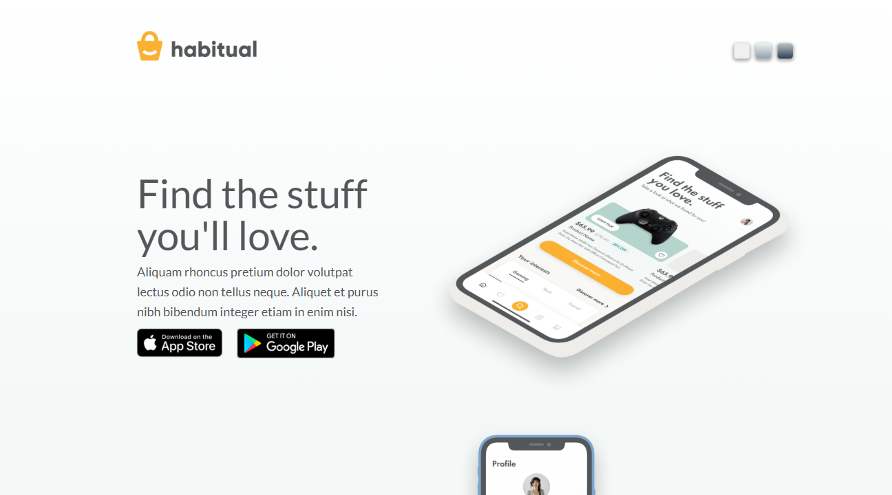

# Splash Page | ZTM JS Web Projects Course

**Project 18/20**

A clean and modern Splash Page that mimics a product landing screen. It features interactive background toggles, branding, promotional text, and links to download apps on the App Store and Google Play. This project focuses on layout precision, visuals, and simple interactivity for a professional landing experience.

---

## 📚 Table of Contents

- [🔎 Overview](#-overview)
  - [📸 Screenshot](#-screenshot)
  - [🔗 Links](#-links)
  - [📌 Features](#-features)
  - [🛠️ Built with](#️-built-with)
- [🧠 My process](#-my-process)
  - [🗃️ Useful resources](#️-useful-resources)
  - [🔙 Previous Project](#-previous-project)
  - [🔜 Next Project](#-next-project)
- [👤 Author](#-author)
  - [🌐 Connect with Me](#-connect-with-me)
  - [💻 Coding Profiles](#-coding-profiles)

---

## 🔎 Overview

### 📸 Screenshot

### 🔗 Links

  - [🔴 Live Demo](https://dalascript.github.io/splash-page/)
  - [🗂️ GitHub Repository](https://github.com/DalaScript/splash-page)

### 📌 Features

  - ✅ Responsive and pixel-precise landing page layout
  - ✅ Interactive background toggle with multiple themes
  - ✅ App download buttons for App Store & Google Play
  - ✅ Clean typography and balanced spacing with Lato font
  - ✅ Multiple mockup images for realistic product showcase

### 🛠️ Built with

  - HTML5
  - CSS3
  - JavaScript

---

## 🧠 My Process

### 🗃️ Useful resources

  - [Figma – Dev Handoff Tips](https://www.figma.com/best-practices/tips-on-developer-handoff/)
  - [Figma – Showcase Website File](https://www.figma.com/file/4KIM14zOqqIKRuF8kBtHGs/Showcase-Website?node-id=1%3A2)
  - [Google Fonts](https://fonts.google.com/)
  - [Hero Patterns – SVG Backgrounds](https://heropatterns.com/)
  - [uiGradients – Gradient Backgrounds](https://uigradients.com/#Portrait)
  - [W3Schools – JavaScript Switch](https://www.w3schools.com/js/js_switch.asp)
  - [MDN – Conditional (Ternary) Operator](https://developer.mozilla.org/en-US/docs/Web/JavaScript/Reference/Operators/Conditional_operator)
  - [Google DevTools – Heap Snapshots](https://developers.google.com/web/tools/chrome-devtools/memory-problems/heap-snapshots)

### 🔙 Previous Project

 - Calculator | *Project 17/20* → [View Repository](https://github.com/DalaScript/calculator)

### 🔜 Next Project

 - Paint Clone | *Project 19/20* → [View Repository](https://github.com/DalaScript/paint-clone)

---

## 👤 Author

### 🌐 Connect with Me

 - [Instagram](https://www.instagram.com/DalaScript)
 - [YouTube](https://www.youtube.com/@DalaScript)

### 💻 Coding Profiles

 - [freeCodeCamp](https://www.freecodecamp.org/DalaScript)
 - [FrontendMentor](https://www.frontendmentor.io/profile/DalaScript)
 - [GitHub](https://github.com/DalaScript)

*🙌 Thanks for checking out my project! More coming soon. Stay tuned 🚀*
